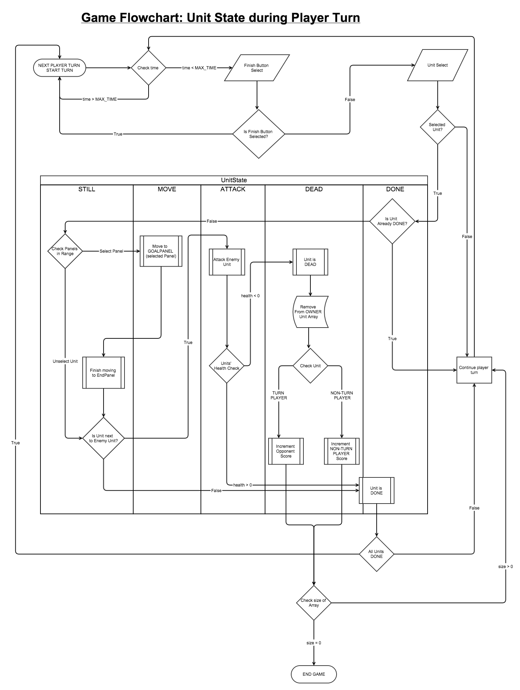

#Artificial Intelligence#
----

For the AI framework, gdx-ai is being used. See [wiki](https://github.com/libgdx/gdx-ai/wiki)

Added to gradle:
    
    compile "com.badlogicgames.gdx:gdx-ai:1.5.0"

Most likley will use StateMachine interface infused with BehaviorTree format. For information about how gdx-ai
decision making strategies work, see the package-info in the ai package package.

3 choices for gdx-ai implementation:
1) Using Finite Stack Machine by itself
    PROS: It will be easy to represent the UnitStates which allows for actions on screen to be easily integrated
        with what AI is doing. Also, I have already started creating the classes.
    CONS: since multiple units will be interacting, there will have to be many StateMachines and therefore
        a lot fo states. This can make things messy for AI & overload memory.

2) Decision tree by itself
    PROS: can make logic flow easier
    CONS: state representation of units may be harder

3) Stack machine with decision tree
    PROS: allows best of both worlds of AI methods & allows more control over game AI 
    CONS: could make things a bit more complicated then they should be
    
For help deciding, create more UMLs on how AI would work specifically.

UML for overall game flow, how units act during players turn

##State Machine##
----

Properties of a "Unit Agent":

a) sees where player has their units positioned & analyzes properties of units

b) sees where it has units positioned & analyzes their properties

c) compares (a) with (b) to determine where to move
    - rules for (c) can change based on AI difficulty setting
        eg. easy will just go attack any unit, while hard will strategically

d) AgentState: information about a Unit - UnitState & location
    - UnitState: depicts whether they are still, moving or attacking (which direction) or dead
    - Location: where that unit is on the board relative to other units & opponent units

##BehaviorTree Tasks##
----

A different type of AI implementation. Uses LeafTasks in a BehaviorTree heirarchy to make decisions about
what units should be doing. 

          
Here is the Task Class Hierarchy from gdx-ai [wiki](https://github.com/libgdx/gdx-ai/wiki/Behavior-Trees)

###Types of Tasks###

####Text Format####

Text format, as shown in following example, is a data-driven programming style that is injected into the BehaviorTree.
Within the text, one imports the task classes and then defines what they do.

Need to use a text file with .tree extension with the library when creating text files for gdx-ai to parse.

Lines follow this format:

    [[indent] [name [attr:value [...]]] [comment]]
    
An example, from gdx-ai-tests:

    #
    # Dog tree
    #
    
    # Alias definitions
    import bark:"com.badlogic.gdx.ai.tests.btree.dog.BarkTask"
    import care:"com.badlogic.gdx.ai.tests.btree.dog.CareTask"
    import mark:"com.badlogic.gdx.ai.tests.btree.dog.MarkTask"
    import walk:"com.badlogic.gdx.ai.tests.btree.dog.WalkTask"
    
    # Tree definition (note that root is optional)
    root
      selector
        parallel #
          care urgentProb:0.8
          alwaysFail
            com.badlogic.gdx.ai.tests.btree.dog.RestTask # fully qualified task
        sequence
          bark times:"uniform,1,5"
          walk
          com.badlogic.gdx.ai.tests.btree.dog.BarkTask # fully qualified task
          mark

A graphical representation of this tree:

![here] (https://cloud.githubusercontent.com/assets/2366334/4617800/190bc6c4-5303-11e4-8c52-07470f9a36d7.png)

A ? in front of the import statment makes it clear that the extended LeafTask is a condition.

    import :"com...ClassCondition" 
    
    
TODO: design a BehaviorTree graphical representaiton of the overall AI Unit decision logic.

##Forward Strategy AI Design##
----

Using the gdx-ai extension library, 2 methods are combined: BehaviorTrees & StateMachines.
This seemed logical given the problem at hand.

PROBLEM:
For the ForwardStrategy AI, multiple Units need to move autonomously AND need to
cooperate by using a strategy. They need to be aware of each other, the player Units and
the overall strategy being implemented.

SOLUTION:
To solve this problem, 2 AI methods are used: Finite State Machines & Decision Trees. 

The state machine allows for direct representation of Unit actor actions while outputting information
about the Unit actor states on the board and the actions they take.
The decision tree contains the tactical archetype that brings together the individual actions 
the state machines are responsible for communicating to/from the game flow.

The behavior tree uses the idea of a "blackboard", which as it sounds, contains the layout
for what can actually be used in real-time. The tasks are simply archetypes contained within
the AgentManager that push decisions onto the UnitAgents.

md = MessageDispatcher

UnitAgent <--[md]--> State <--[md]-->AgentManager<----Tasks<---BehaviorTree <---|
                                        |_______________________________________|

